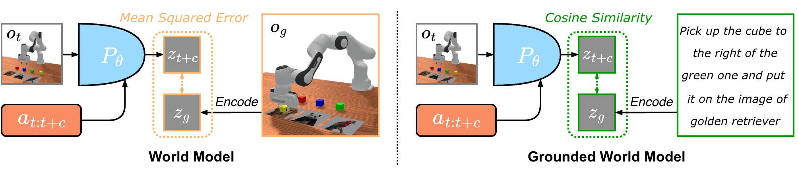
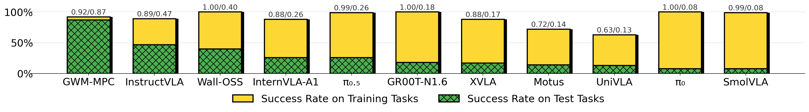

# Grounded World Model for Semantically Generalizable Planning

[[arXiv]](https://arxiv.org/abs/2604.11751) [[checkpoint]](https://huggingface.co/Shady0057/GWM) [[dataset]](https://huggingface.co/datasets/Shady0057/WISER)


This repository contains the code for **GWM (Grounded World Model)** and the **WISER** benchmark.

GWM is a vision-language aligned world model that predicts future visual embeddings grounded in natural language, enabling semantically generalizable planning in manipulation tasks. 
WISER (**W**orld-knowledge **I**ntegrated **S**emantic **E**mbodied **R**easoning) is the accompanying benchmark — a language-conditioned pick-and-place benchmark built on [ManiSkill](https://github.com/haosulab/ManiSkill) with 576 tasks (288 training + 288 held-out testing) covering massive open-world visual signals and aligned referring expressions.

## Performance

The success rate gap on training and test tasks indicates the semantic generalizability. The larger the gap, the worse the generalizability.


## Installation

A bare `pip install -e .` is **not allowed** — you must specify an extras group:

```bash
# WISER benchmark + LeRobot Baselines only (ManiSkill + LeRobot + tensordict)
pip install -e '.[wiser]'

# GWM + WISER (adds transformers, scikit-learn for GWM training/eval)
pip install -e '.[gwm+wiser]'
```

> **Note:** To train pi0/wall-x policies, also install the corresponding LeRobot extras:
> `pip install lerobot[pi]`, `pip install lerobot[wallx]`.

Also install ffmpeg for video decoding:

```bash
conda install ffmpeg==6.1.1
```

---

## Scripts Reference
These scripts are the main entry points for training and evaluation. 
They can run on a single machine or on a cluster like SLURM.

| Script | Purpose |
|--------|---------|
| `scripts/save_demo.py` | Collect expert demonstrations across all configs for both training and test |
| `scripts/save_skill.py` | Collect a single-config skill dataset without RGB images for GWM/retrieval |
| `scripts/gwm_train.py` | Train the Grounded World Model |
| `scripts/gwm_eval.py` | Evaluate GWM or retrieval-based (GT-MPC) planners |
| `scripts/lerobot_train.py` | Train LeRobot policies (pi0, SmolVLA, WallX, etc.) |
| `scripts/lerobot_eval.py` | Evaluate trained LeRobot policies |

SLURM submission scripts for each workflow are in `scripts/slurm/`. They also record the default parameters for these standalone scripts.

> **Note:** The paths in SLURM scripts may need to be updated to match your environment.

---

## Dataset

The WISER dataset is collected with **LeRobot v0.4.3** in **LeRobotDataset v3.0** format. It is hosted on HuggingFace at [`Shady0057/WISER`](https://huggingface.co/datasets/Shady0057/WISER).

| Split | Format | Size | Usage |
|-------|--------|------|-------|
| `merged_train` | LeRobot v3.0 | 2 GB | **Training** — used by all training scripts |
| `merged_test` | LeRobot v3.0 | 332 MB | **Validation only** — validation loss during training and GT-MPC evaluation |
| `no_noise_demo_1_round` | LeRobot v3.0 | 679 MB | **GT-MPC** — 1/6 of training data + all test data (pre-merged ) |
| `rlds_train` | RLDS/TFDS | 21 GB | **Training** — for OpenVLA / InstructVLA / UniVLA baselines |

> ⚠️ `merged_test` is **never** used for training. It is only loaded for computing validation metrics and running the GT-MPC planner.

### Download

```bash
# Install HuggingFace CLI (if not already installed)
pip install huggingface_hub[cli]

# Download LeRobot splits + GT-MPC data into wiser_dataset/
hf download Shady0057/WISER \
    --repo-type dataset \
    --include "merged_train/**" "merged_test/**" "no_noise_demo_1_round/**" "README.md" \
    --local-dir wiser_dataset
```

This places the dataset at `wiser_dataset/` in the repo root, which is the default path expected by all training and evaluation scripts.

### Collect Your Own

Alternatively, you can collect the dataset yourself using the rule-based mplib expert planner. This is useful if you need a different LeRobot version, a customized dataloader, or modified collection parameters:

```bash
python gwm_wiser/scripts/save_demo.py \
    --start_index 0 --end_index 24 \
    --dataset_name wiser_dataset
```

This collects 1 no-noise round for both train and test tasks, and 5 additional noised rounds for training tasks only, then merges into `wiser_dataset/merged_train` and `wiser_dataset/merged_test`. For parallel data collection on a cluster, use the provided SLURM script:

```bash
sbatch gwm_wiser/scripts/slurm/submit_save_demo.run
```

> **Note:** If you are collecting demos with the mplib planner, make sure `numpy==1.26.4` is installed. Pip warnings can be safely ignored.

---

## WISER Environment

The core interface is simple — build an environment with `build_endless_env`, then use `rollout()` for evaluation and data collection:

```python
from gwm_wiser.env.config import get_env_cfg
from gwm_wiser.utils.env import build_endless_env
from gwm_wiser.utils.rollout import rollout

# Configure and build the environment (12 parallel envs)
env_cfg = get_env_cfg(
    num_env=12,
    max_steps=120,
    obs_mode="rgb+segmentation",
    scene_cfg_to_overwrite=dict(mode="train", cfg_name="config_0"),
)
envs = build_endless_env(env_cfg, record_video=False, data_record_dir="output")

# Run rollout with any policy and optionally save demos
results = rollout(
    envs,
    policy=your_policy_fn,  # (obs) -> (action, expert_action, info)
    round_to_collect=1,  # total episodes = num_env × rounds
    demo_saving_dir="./demos",  # None to skip saving
)

envs.unwrapped.close()
```

`scripts/save_demo.py` is a good example of using these interfaces for data collection.
`scripts/lerobot_eval.py` is a good example of using these interfaces for evaluation.


---

## Grounded World Model

### 1. Ground-Truth Planner (GT-MPC)

The GT-MPC planner retrieves future observations directly from the pre-collected demonstrations to plan actions.
See `slurm/submit_gwm_eval.run` for the full distributed evaluation setup (set `USE_GT=true` to enable GT-MPC).
It uses ground-truth observations from the `--dataset_root` path; by default this path points to the `wiser_dataset/no_noise_demo_1_round` folder.

GT-MPC requires access to future observations — this is only feasible when the demonstrations are available. To evaluate on truly held-out test scenarios where future observations are unknown, we need to train GWM on the training set to **predict** future visual outcomes.

### 2. Train GWM

Train the Grounded World Model on `merged_train` with multi-node DDP. See `slurm/submit_gwm.run` for the full parameter configuration:
```bash
sbatch gwm_wiser/scripts/slurm/submit_gwm.run
```
For action-conditioned GWM without rendering-based-tokenization, see `slurm/submit_gwm_ac.run`.
Pre-trained GWM checkpoints are available on HuggingFace:

| Model | HuggingFace Repo |
|-------|-----------------|
| GWM | [`Shady0057/GWM`](https://huggingface.co/Shady0057/GWM) |

Download:

```bash
hf download Shady0057/GWM --local-dir gwm_ckpt
```

Then point `--gwm_ckpt_path` to the downloaded checkpoint when running evaluation.

### 3. Evaluate GWM

Evaluate the trained GWM planner across all configs with `gwm_eval.py`.
See `slurm/submit_gwm_eval.run` for the distributed evaluation setup:

```bash
sbatch gwm_wiser/scripts/slurm/submit_gwm_eval.run
```

Results are aggregated automatically at the end of the SLURM job. The distributed evaluation also supports restoring from interruption — only configs that have not yet been evaluated will be re-run.

The GWM planner uses a KNN to retrieve skills from training dataset.
To safely exclude any possibility of ground-truth observation leakage, we retrieve from a mini split of the full training set, where all RGB images are masked.
This mini split is already prepared at `gwm_skills`, and is generated with the following scripts.

```bash
python gwm_wiser/scripts/save_skill.py --robot panda # or xarm6
```

Alternatively, you can use any subset of the training data, as long as they cover all 12 unique skills required by WISER, such as `config_0_train` from `no_noise_demo_1_round`.

---

## VLA Baselines

### Train

Train any LeRobot-compatible policy (pi0, SmolVLA, WallX, etc.) on `merged_train`. Refer to the SLURM scripts for full parameter configurations:

| Policy | SLURM Script |
|--------|-------------|
| pi0 | `slurm/submit_pi0.run` |
| pi0-FAST | `slurm/submit_pi0fast.run` |
| pi0.5 | `slurm/submit_pi05.run` |
| SmolVLA | `slurm/submit_smolvla.run` |
| WallX-OSS | `slurm/submit_walloss.run` |
| xVLA | `slurm/submit_xvla.run` |
| others | In forked repos |

Example:

```bash
sbatch gwm_wiser/scripts/slurm/submit_pi0.run
```

### Evaluate

Evaluate a trained LeRobot policy. Refer to the corresponding `*_eval.run` scripts (e.g. `slurm/submit_pi0_eval.run`) for full configurations:

```bash
sbatch gwm_wiser/scripts/slurm/submit_pi0_eval.run
```

Restore from interruption is also supported for baselines evaluation scripts.

---

## Convert to RLDS

The WISER dataset can be converted from LeRobot format to [RLDS/TFDS](https://github.com/google-research/rlds) for training external baselines (e.g. OpenVLA-OFT, InstructVLA). The RLDS-converted split is also available on the same huggingface repo. To download it:

```bash
hf download Shady0057/WISER \
    --repo-type dataset \
    --include "rlds_train/**" \
    --local-dir wiser_dataset
```

Or you can convert the LeRobot dataset to RLDS with the following script:

```bash
sbatch gwm_wiser/scripts/slurm/submit_convert_rlds.run
```

---

## Citation

If you find this work useful, please cite our paper:

```bibtex
@misc{li2026groundedworldmodelsemantically,
      title={Grounded World Model for Semantically Generalizable Planning}, 
      author={Quanyi Li and Lan Feng and Haonan Zhang and Wuyang Li and Letian Wang and Alexandre Alahi and Harold Soh},
      year={2026},
      eprint={2604.11751},
      archivePrefix={arXiv},
      primaryClass={cs.RO},
      url={https://arxiv.org/abs/2604.11751}, 
}
```
