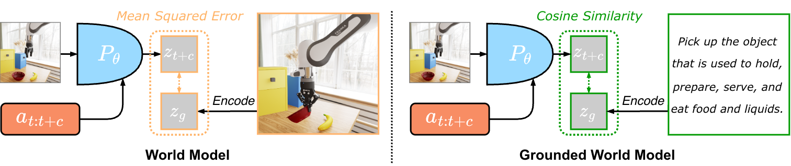
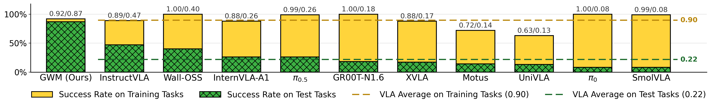

# Grounded World Model for Semantically Generalizable Planning

[Paper](https://arxiv.org/abs/2604.11751) · [Website](https://quanyili.github.io/gwm-wiser/) · [WISER checkpoint](https://huggingface.co/Shady0057/GWM) · [DROID checkpoint](https://huggingface.co/Shady0057/GWM/tree/main/real_data) · [WISER dataset](https://huggingface.co/datasets/Shady0057/WISER)

**GWM (Grounded World Model)** predicts future visual embeddings from an observation and candidate actions. A frozen vision-language readout scores these predictions against language goals for planning.



This repository contains the core GWM implementation, the **WISER testbed**, real-data training, and the GWM × TiPToP system for simulation and Franka hardware. WISER provides 288 training and 288 held-out test tasks in ManiSkill for studying semantic generalization.



## Code map

| Task | Start here |
| --- | --- |
| WISER environment, tasks and assets | [gwm_wiser/env](gwm_wiser/env), [gwm_wiser/assets](gwm_wiser/assets) |
| GWM model and planning | [gwm_wiser/models](gwm_wiser/models), [gwm_wiser/planner](gwm_wiser/planner) |
| WISER data collection, GWM/VLA training and evaluation | [gwm_wiser/scripts](gwm_wiser/scripts), [SLURM recipes](gwm_wiser/scripts/slurm) |
| GT-MPC sweeps and z-direct ablation | [sweeps](gwm_wiser/scripts/slurm/sweeps), [zdirect](gwm_wiser/scripts/slurm/zdirect) |
| DROID/MolmoBot data preparation and GWM training | [real_data_train](real_data_train), [training entrypoint](real_data_train/train.py), [recipes](real_data_train/slurm) |
| GWM scoring service and TiPToP integration | [droid/server](droid/server), [droid/gwm_tiptop](droid/gwm_tiptop) |
| DROID-sim evaluation and V-JEPA 2-AC baseline | [droid/droid-sim-evals-ours](droid/droid-sim-evals-ours), [droid/v-jepa](droid/v-jepa) |
| Pointing, drawer selection and pushing probes | [pointing](droid/gwm_point_cem), [drawer](droid/gwm_drawer/README.md), [pushing](droid/gwm_push_cem/README.md) |
| Franka hardware | [droid/gwm_hardware](droid/gwm_hardware), [GWM entrypoint](droid/gwm_hardware/gwm_arm/run.sh) |

## WISER setup

Use Python 3.11+ and a compatible GPU environment. From the repository root:

```bash
pip install -e '.[gwm+wiser]'
conda install ffmpeg==6.1.1
```

Use `.[wiser]` for WISER and LeRobot workflows without GWM. Install the corresponding LeRobot extras for policies that require them.

Download the WISER data and checkpoint with the Hugging Face CLI:

```bash
hf download Shady0057/WISER --repo-type dataset \
    --include 'merged_train/**' 'merged_test/**' 'no_noise_demo_1_round/**' \
    --local-dir wiser_dataset
hf download Shady0057/GWM checkpoint.pt --local-dir gwm_ckpt
```

`merged_train` is used for training; `merged_test` is held out for validation. GT-MPC uses recorded future observations from `no_noise_demo_1_round`. Learned GWM planning uses the RGB-free skill data in [gwm_skills](gwm_skills) and predicts future embeddings.

The main entrypoints are [gwm_train.py](gwm_wiser/scripts/gwm_train.py) and [gwm_eval.py](gwm_wiser/scripts/gwm_eval.py). For concrete configurations, start with [submit_gwm.run](gwm_wiser/scripts/slurm/submit_gwm.run) and [submit_gwm_eval.run](gwm_wiser/scripts/slurm/submit_gwm_eval.run). Set the dataset, GWM checkpoint and Qwen3-VL-Embedding paths for your machine before running. The same directory contains collection and LeRobot baseline recipes.

## Real-data and robotics setup

The [DROID checkpoint](https://huggingface.co/Shady0057/GWM/tree/main/real_data), trained on MolmoAct2-DROID and MolmoBot, is available for the simulation and hardware workflows:

```bash
hf download Shady0057/GWM real_data/checkpoint.pt --local-dir gwm_ckpt
```

Use `gwm_ckpt/real_data/checkpoint.pt` as the GWM checkpoint. The companion `Qwen/Qwen3-VL-Embedding-8B` encoder must be downloaded separately.

Real-data preparation and training recipes are in [real_data_train/slurm](real_data_train/slurm). The robotics stack uses separate environments; start with the TiPToP [installation](droid/tiptop/docs/installation.md) and [simulation](droid/tiptop/docs/simulation.md) guides, then the relevant code-map entry above. Launch scripts contain machine-specific paths and service settings that need adapting.

This is a source repository. Large datasets, checkpoints, simulator assets and generated robot assets are separate. The upstream DROID simulator, FoundationStereo, cuRobo/cuTAMP, V-JEPA 2 source and some VLA baseline forks must also be installed separately. Our drivers expect the simulator checkout at `droid/droid-sim-evals/` and V-JEPA 2 at `droid/v-jepa/vjepa2/`. TiPToP and M2T2 source are included under [droid/tiptop](droid/tiptop) and [droid/M2T2](droid/M2T2).

## Citation

If you find this work useful, please cite our paper:

```bibtex
@misc{li2026groundedworldmodelsemantically,
      title={Grounded World Model for Semantically Generalizable Planning}, 
      author={Quanyi Li and Lan Feng and Haonan Zhang and Wuyang Li and Letian Wang and Alexandre Alahi and Harold Soh},
      year={2026},
      eprint={2604.11751},
      archivePrefix={arXiv},
      primaryClass={cs.RO},
      url={https://arxiv.org/abs/2604.11751}, 
}
```
