# TiPToP × GWM Integration Plan

**Goal:** Use TiPToP's 3D scene reconstruction + cuTAMP trajectory proposal as the *semantic-free* trajectory proposer, and GWM (Grounded World Model) as the *only* semantic component — scoring all proposed trajectories against the language instruction. Gemini-ER and SAM-as-semantics are fully bypassed: perception becomes class-agnostic geometry, and "which object / which trajectory matches the instruction" is decided exclusively by GWM.

**Scope of v1:** pick-only tasks. Target sequence: droid-sim (IsaacLab) → MolmoSpaces leaderboard → real hardware.

*Status: plan agreed 2026-08-06 after design review; merged into `real_data_train/docs` the same day (original at `/root/code/gwm/docs` deleted). Repos: `/root/code/gwm/gwm-wiser/droid/tiptop` (host system), `/root/code/gwm/gwm-wiser` (scorer, read-only dependency). This document is the **system-level plan** (milestones M0–M4); the M2 retraining milestone's detailed plan of record is [plan.md](plan.md), which supersedes this document's M2 details where they differ. WISER and VRS are fully retired (ADR-0016/0018); residual mentions below were edited accordingly.*

---

## 1. Background: how each system works at inference

### 1.1 TiPToP (proposer side)

Pipeline: `(RGB, depth, K, world_from_cam, instruction, q_init)` → perception → 3D scene → cuTAMP search → joint-space trajectory.

1. **Perception:** depth → world-frame `xyz_map (H,W,3)`; M2T2 generates ~200 6-DOF grasps from the *whole-scene* point cloud (`tiptop/perception/m2t2.py:113` — no masks needed); Gemini-ER does open-vocab detection **and** task translation to goal atoms in one call (`tiptop/perception/gemini.py:98`); SAM2 turns Gemini boxes into masks (`tiptop/perception/sam2.py:120`).
2. **Scene building:** `process_scene_geometry` (`tiptop/tiptop_run.py:311`) — RANSAC table plane (mask contact points score candidate planes), per-mask convex-hull object meshes, grasp→object association via KDTree → `ProcessedScene` (curobo meshes + per-object grasps).
3. **Proposal (cuTAMP):** ≤10 plan skeletons × 256 particles (grasp choice, placement, IK confs) optimized in parallel with Adam against differentiable constraints; satisfying particles ranked by summed M2T2 confidence (`cutamp/algorithm.py:151-197`); cuRobo motion-refines them one at a time and **the first success wins** (`cutamp/algorithm.py:634-661`, `break_on_satisfying=True`). Output: joint-position trajectories `(T,7)` + discrete gripper events, serialized by `serialize_plan` (`tiptop/planning.py:129`).

**The SAM/Gemini boundary is three plain data structures** — `masks (N,1,H,W)`, `bboxes [{box_2d,label}]`, `grounded_atoms [{predicate,args}]`. Everything below imports and runs without either model (they are lazily imported inside `detect_and_segment`, `tiptop/perception_wrapper.py:21`).

### 1.2 GWM (scorer side)

GWM is **not** a video generator and **not** a policy. It is a semantic outcome predictor: given `[current full RGB, 5 robot-only renders of a candidate motion]` (the "RAT" video), it predicts the frozen Qwen3-VL-Embedding-8B latent of the *future full-scene video* in one forward pass, which is pooled to a `(4096,)` vector and scored by cosine similarity against a language sub-goal embedding.

- Candidates enter **only as 6 rendered robot-only RGB frames** — GWM never consumes raw actions. `RobotRenderer` (`gwm_wiser/utils/robot_renderer.py:103`) converts joint actions → those renders.
- Scoring seam: `score_trajectories` (`gwm_wiser/planner/retrieval.py:473`) + `GWMBasedPlanner.get_video_embedding` (`gwm_wiser/planner/gwm.py:121`). Candidates are duck-typed — only `traj.images_robot_state` is read; hand-constructed `RetrievedTrajectory` objects work.
- Model stack: frozen Qwen3-VL-Embedding-8B (~16 GB, pinned `transformers==4.57.6`) + GWM transformer (747 M, ~1.5 GB bf16). `VariableLenGWM` (`real_data_train/gwm_model.py:16`) accepts any `4*N` sequence length with bit-exact parity at the canonical 1620.
- Current checkpoint contract: WISER ManiSkill, Panda, fixed 448×224 camera, 60-step / 3 s / 20 Hz chunks, 6 frames at `np.linspace(0,59,6)`.
- Training needs **no language or task labels** — pure visual prediction from (full RGB video + robot-only stream). Any robot video with a robot render stream is usable data.
- The repo's own ADRs ([adr/0003](adr/0003-keep-trajectory-proposal-and-execution-external.md)) state trajectory proposal is deliberately external — this plan is aligned with GWM's design intent.

### 1.3 droid-sim-evals interface (v1 debugging environment)

Websocket schema (`tiptop/tiptop_websocket_server.py:172-217`), per request: `rgb (H,W,3)`, GT `depth (H,W)`, `intrinsics (3,3)`, `world_from_cam (4,4)`, `task` (string), `q_init (7,)`. Single static external camera. **No segmentation, no object poses, no gripper state.** Response: serialized plan JSON. Repo: [tiptop-robot/droid-sim-evals](https://github.com/tiptop-robot/droid-sim-evals) (fork of [arhanjain/sim-evals](https://github.com/arhanjain/sim-evals), IsaacLab, 5 scenes × ~10 variants, Franka/DROID rig).

### 1.4 MolmoSpaces (leaderboard target)

- Ai2 benchmark ([arXiv:2602.11337](https://arxiv.org/abs/2602.11337)): 230k+ indoor scenes, 130k objects, 42M grasps; MuJoCo primary. 8 tasks incl. Pick, Pick&Place, Place-NextTo, Open/Close. Instructions: `task_description` (e.g. "Pick up a white bowl") + `referral_expressions`.
- Franka FR3 manipulation rig is **deliberately DROID-matched** (camera intrinsics/extrinsics follow the DROID system) — favorable for a DROID-trained GWM.
- Eval runs locally (openpi-style policy server, port 8080, `ms-bench` / `eval_main.py`); submission = CSV via GitHub issue on [allenai/molmospaces](https://github.com/allenai/molmospaces).
- **TiPToP's published score: 46.1%** over 9 tasks × 1000 episodes — #1 among methods not trained on MolmoBot data. This is our reference baseline.
- **MolmoBot-Data** ([HF](https://huggingface.co/datasets/allenai/MolmoBot-Data), 10.3 TB): ~1.8 M scripted expert trajectories (motion-planned, 15 Hz, pure sim, zero DROID/OXE overlap). Per-episode HDF5 contains per-timestep `qpos`, five action encodings, and **per-camera per-timestep `intrinsic_cv (T,3,3)` + `cam2world_gl (T,4,4)`** + MP4 streams (Franka: 5 cams @ 624×352) → robot-only re-rendering from URDF is possible, so GWM can train directly on it. Verified 2026-08-06: **no distortion is baked into the data** — only pinhole calibration exists and the GoPro-analogue stream renders undistorted; fisheye is MolmoBot's own training-time augmentation (see plan.md / references.md).

---

## 2. Design decisions (settled)

| # | Decision | Choice | Rationale |
|---|---|---|---|
| D1 | v1 environment | droid-sim (IsaacLab) for debugging; MolmoSpaces for scoring; hardware last | GWM will be retrained anyway; droid-sim is TiPToP-native |
| D2 | Semantics ownership | Full goal enumeration; GWM owns all semantics. Pick-only v1: TiPToP used **up to grasp synthesis**, then all geometry-feasible trajectories proposed | The core scientific claim: no semantic FMs in the loop |
| D3 | Mask source | ~~**SAM2 automask** (no boxes, no Gemini); segments become anonymous movables `object_0..N`~~ **Superseded 2026-08-09 (G-2):** no SAM2 at all — pure geometric clustering (mask-free table RANSAC + DBSCAN above the plane); automask kept only as recorded fallback. See `/root/code/gwm/gwm-wiser/droid/tiptop/gwm_integrate_doc/plan.md` | Masks serve geometry only; params tuned experimentally |
| D4 | Proposal machinery | **Keep cuTAMP**: enumerate a `[MoveFree, Pick(object_i)]` skeleton per segment *(mechanics revised 2026-08-09, G-4: no fork and no `break_on_satisfying` change — cuTAMP is consumed as an unmodified library by a `run_proposals` orchestrator that collects all refinement successes)* | Small change, reuses all particle/collision/IK machinery, keeps the path to Place open |
| D5 | Candidate count & diversity | 12–16 executable candidates. Diversity via **confidence-weighted farthest-point sampling over grasp poses (SE(3))**, ~4–8 grasps/object, *before* motion refinement | Trajectory diversity is determined at the grasp; FPS at the source is cheaper than trajectory-space clustering (add DTW clustering later only if needed) |
| D6 | What GWM ranks | **Only final motion-refined executable trajectories** (feasibility mask + M2T2-weighted FPS act as pre-filters) | Score exactly what will execute; avoid scoring particles that later fail refinement |
| D7 | GWM retraining data | **MolmoAct2-DROID-Dataset (real) + MolmoBot-Data Franka subset (sim)**. VRS retired to documentation only — no training arm, no ablation arm (ADR-0016 as amended) | Both sources carry qpos + camera calibration and clean licenses (Apache-2.0 / ODC-BY); VRS is research-only unlicensed derivatives (ADR-0009) and mask-derived appearance mismatches the render-based inference path |
| D8 | Renderer | **SAPIEN clone of `RobotRenderer`** with per-source URDF (verified: Panda+2F-85 for the real DROID data; FR3+2F-85 for MolmoBot/MolmoSpaces/hardware; **corrected 2026-08-09: droid-sim is Panda+2F-85** — live joint names + USD, overlay-verified, Robotiq standoff 18.2 mm per-rig; see tiptop `gwm_integrate_doc/plan.md` GI-2 findings), runtime-injected K/extrinsics. Same renderer for ALL training-data generation AND inference scoring | Train/inference render homology is a hard requirement; one component serves MolmoAct2-DROID robot-only streams, MolmoBot-Data re-rendering, droid-sim/MolmoSpaces inference, and real hardware |
| D9 | Architecture | GWM scorer as a **TiPToP-style microservice** (FastAPI `gwm-server`, mirrors M2T2/SAM servers); gwm-wiser stays read-only | Process boundary isolates conflicting pinned deps (`transformers==4.57.6` vs pixi env); natural multi-GPU split |
| D10 | Success criterion | MolmoSpaces **Pick subset: match-or-beat TiPToP** (≤2 pp gap = match); beating is the goal, stretch = beating overall | "Remove all semantic FMs without losing performance" is publishable on its own |
| D11 | Prompting | Use `task_description` verbatim; referral-expression embedding ensemble kept as a cheap ablation | |

---

## 3. Target architecture

```mermaid
flowchart LR
    subgraph SIM["droid-sim / MolmoSpaces / robot"]
        OBS["rgb, depth, K,\nworld_from_cam, q_init,\ninstruction"]
    end
    subgraph TIPTOP["tiptop process (pixi env)"]
        AUTO["SAM2 automask\n(anonymous segments)"]
        GEO["process_scene_geometry\ntable RANSAC + convex hulls"]
        M2T2["M2T2 grasps\n(whole-scene cloud)"]
        FPS["confidence-weighted\nSE(3) FPS grasp selection"]
        TAMP["cuTAMP: Pick(object_i)\nskeleton per segment"]
        REFINE["cuRobo motion refine\n→ 12–16 executable trajs"]
    end
    subgraph GWMSRV["gwm-server (own env/GPU)"]
        REND["SAPIEN FR3+Robotiq\nrenderer (runtime K/extr.)"]
        RAT["RAT: [current RGB,\nrobot-only ×5]"]
        QWEN["Qwen3-VL encode"]
        GWM["GWM forward\n→ outcome embedding"]
        SCORE["cosine vs instruction\nembedding → argmax"]
    end
    OBS --> AUTO --> GEO --> TAMP
    OBS --> M2T2 --> FPS --> TAMP
    TAMP --> REFINE -->|"candidates + camera params\n+ current RGB + instruction"| REND
    REND --> RAT --> QWEN --> GWM --> SCORE
    SCORE -->|winner| EXEC["execute plan JSON"]
```



**Scorer service API (sketch):**

```
POST /score
{
  "rgb": ...,                      # current full frame
  "intrinsics": [[...]],           # (3,3)
  "world_from_cam": [[...]],       # (4,4)
  "instruction": "Pick up the white bowl",
  "candidates": [                  # 12–16 items, serialize_plan-style
    {"positions": [[...]], "dt": 0.05, "gripper_events": [...]},
    ...
  ]
}
→ {"scores": [...], "argmax": 3, "sub_scores": [...]}
```

Internally per candidate: sample 6 qpos frames across the trajectory → render robot-only frames → build RAT `[current_rgb, robot_only[1:6]]` → `encode_trajectory` → GWM forward → `embed_video_latent` + `pooling_video_latent` → cosine vs `_get_task_embedding(instruction, first_frame, current_frame)` → softmax across candidates.

---

## 4. Milestones

**Execution order (revised 2026-08-06): GWM retraining is Stage 1 and starts first.** The M-numbers below are retained for reference, but the stages run as:

| Stage | Content | Runs |
| --- | --- | --- |
| **1 — GWM retraining (top priority)** | M2, **plus the `FrankaRobotRenderer` build pulled forward from M0.2** (training-set construction needs it before anything else); full pre-launch gates per [plan.md](plan.md) | starts immediately |
| **2 — droid-sim pipeline** | M0 (baseline repro + renderer-vs-droid-sim overlay validation, using the Stage-1 renderer) + M1 (semantic-free proposer + `gwm-server` mechanics with the old checkpoint as weights stand-in) | **in parallel with Stage 1**, done before training finishes |
| **3 — MolmoSpaces + iteration** | M3 leaderboard runs; Stage-2/3 performance feeds back into debugging the Stage-1 GWM (corpus mix, chunk convention, candidate count) and the other modules | after Stages 1–2 converge |
| **4 — Hardware** | M4 | last |

### M0 — Baselines + the shared renderer (foundation)

**Tasks**
1. Reproduce TiPToP on droid-sim (websocket + H5 modes); record pick-task baseline success over the 5 scenes × variants. Needs: M2T2 server, `GOOGLE_API_KEY` (baseline only), droid-sim-evals clone + assets.
2. **`FrankaRobotRenderer` — pulled forward into Stage 1** (built under `real_data_train/` because training-set construction needs it first; plan.md D-1): SAPIEN, FR3/Panda + Robotiq 2F-85 URDFs, batched `qpos → robot-only RGB (N,H,W,3)`, camera K/extrinsics/resolution injected at call time (droid-sim provides them per request; MolmoBot-Data per frame). Pattern: `gwm_wiser/utils/robot_renderer.py:103`. This M0 task reduces to *validating the Stage-1 renderer against droid-sim* (task 3). Scorer-machinery validation happens through this repo's unit tests and the M1 gwm-server smoke test (the former WISER closed-loop repro task is retired with WISER, ADR-0018).
3. Validate the renderer against droid-sim: render the sim's `q_init` with the sim's camera params and overlay on the sim RGB; iterate until visually pixel-aligned. Note: use the **static `external_cam`** (1280×720, fx=fy=500) — the current tiptop websocket client sends the wrist camera, which moves during execution and cannot serve GWM scoring; switch the client when wiring the scorer.

**Deliverables:** baseline numbers table; working renderer + alignment validation notebook/screenshots.
**Exit criteria:** TiPToP baseline reproduced; renderer overlay visually aligned on all 5 droid-sim scenes.

### M1 — Semantic-free proposer + GWM scorer service (mechanics only)

*Plan of record since 2026-08-09: `/root/code/gwm/gwm-wiser/droid/tiptop/gwm_integrate_doc/plan.md` (decision ledger G-1…G-15, mini-milestones GI-0…GI-5) — settled by design grill; it lightens M0.1 to an understanding-level repro (statistical baseline folds into the M2.5 A/B as a fourth arm), supersedes D3, and revises D4's mechanics. The details below remain as originally drafted; the new document wins where they differ.*

**Tasks**
1. **Perception without Gemini:** SAM2 automatic mask generation → anonymous segments (`object_0..N`) with area / table-height / border heuristics to prune sky-high segment counts; `bboxes` synthesized from mask extents; table RANSAC and grasp association unchanged.
2. **Goal enumeration in cuTAMP:** generate `[{"predicate":"holding","args":["object_i"]}]`-style Pick goals per segment in `create_tamp_environment` (`tiptop_run.py:237`); disable `break_on_satisfying`; modify the refinement loop (`cutamp/algorithm.py:634-661`, `tiptop/planning.py:66 max_motion_refine_attempts`) to refine the FPS-selected top-K particles into **K executable trajectories** instead of returning the first success. New entry point `run_proposals(...) → list[plan]` alongside `run_planning`.
3. **Grasp FPS filter:** confidence-weighted farthest-point sampling in SE(3) over M2T2 grasps, ~4–8 per object, 12–16 candidates total.
4. **`gwm-server` microservice:** FastAPI service (own conda/pixi env with `transformers==4.57.6`) wrapping Qwen3-VL-Embedding-8B + GWM checkpoint (`load_canonical_like_planner`, `real_data_train/gwm_model.py:80`) + `FrankaRobotRenderer`; implements `/score` above. Extract the scorer from `GWMBasedPlanner` without its retrieval-coupled constructor (the `MSETrajectoryRetriever` dependency is the only coupling — bypass it).
5. **Thin client in tiptop** + selection = argmax; wire into the websocket server path.
6. End-to-end smoke test on droid-sim **with the old WISER-trained checkpoint as a weights stand-in** — scores are meaningless out-of-domain; this milestone validates *mechanics* (shapes, formats, latency), not selection quality. Only the checkpoint file is touched; no WISER dataset, environment, or skill library is involved (ADR-0018).

**Open experiment (decide in M2):** chunk convention for variable-length pick trajectories — fixed 3 s window vs uniform-6-frames-over-trajectory; deliberately deferred per plan.md's decision record. Whatever is chosen must match between retraining window sampling and inference scoring (`VariableLenGWM` covers non-1620 lengths).

**Deliverables:** `run_proposals` in tiptop; `gwm-server` package; end-to-end droid-sim run producing N candidates + scores + execution.
**Exit criteria:** full loop runs on all 5 scenes without manual intervention; per-request latency budget documented (proposal + K× (render + Qwen encode + GWM forward)).

### M2 — GWM retrained on MolmoAct2-DROID + MolmoBot-Data + droid-sim validation

**Detailed plan of record: [plan.md](plan.md)** (this repo owns M2; the summary below defers to it). The state-rendered path is settled by ADR-0017 and the corpus by ADR-0016; WISER is fully retired by ADR-0018; the token operating grid is anchored to the inference cameras at `(3,18,30)` = 1,620 by ADR-0019. The `real_data_train` code assets (window construction, audit/manifest, trainer, `VariableLenGWM`, canonical export) are reused unchanged — only the corpus and the robot-appearance derivation change.

**Summary (see plan.md for detail and the open-decision table)**
1. **Pre-flight verification (hard gate):** per camera stream, URDF re-projection pixel-aligns with released RGB. Status 2026-08-06: **MolmoBot PASSED** (working K from `frozen_config` FOVs — the h5 `intrinsic_cv` proved unusable; per-episode arm-mount recovery with a ≤2 mm kinematics gate); **MolmoAct2-DROID BLOCKED** — its extrinsics columns are zero-filled across the release, so full camera recovery (plan.md D-26, open) precedes any DROID rendering.
2. **Robot-only streams via `FrankaRobotRenderer`**, written into the normalized rendered tree (ADR-0020: `sources/` readers + `scripts/render_actions.py`; a single `RenderedWindowDataset` on the training side), mandatory audit with renderer/URDF/intrinsics provenance.
3. Cluster training from a subsample (1:1 real:sim, ~1–2 M windows — plan.md D-2), canonical export.
4. Offline eval: held-out MSE/cosine per corpus, real and sim reported separately.
5. **droid-sim selection quality:** checkpoint into `gwm-server`; A/B {GWM score, M2T2-confidence-only, random}; tune automask params, FPS K', candidate count, chunk convention.
6. Corpus-mix ablation if signal is weak: real-only vs sim-only vs mixed. (No VRS arm exists.)

**Deliverables:** canonical GWM checkpoint + audit manifest; pre-flight verification report; A/B results table.
**Exit criteria:** GWM selection **beats both** confidence-only and random baselines on droid-sim pick success — ≥100 episodes per arm, ≥5 pp over the best baseline, confidence intervals reported (plan.md D-10).

### M3 — MolmoSpaces leaderboard

**Tasks**
1. **Policy server for ms-bench:** openpi-style websocket server (port 8080) adapting MolmoSpaces obs (`exo_camera_1` for scoring; `robot_state` qpos; `task_description` verbatim — D11) to the M1 pipeline; joint-position control output (matches TiPToP's plan format and sim-evals' recommendation).
2. **If needed (boost):** the M2 checkpoint already includes MolmoBot-Data (MolmoSpaces-domain); optionally upweight or fine-tune on it, or widen the Franka subset coverage, if droid-sim→MolmoSpaces transfer is the bottleneck. Time-based frame sampling handles 15 Hz vs 20 Hz throughout.
3. Run Pick-v1/v2 locally at full episode counts; `eval_to_csv`; submit via GitHub "Benchmark Entry" issue.
4. Ablations for the paper/report: referral-expression ensemble; FPS vs no-FPS; K sweep; GWM vs Gemini goal grounding (TiPToP's own numbers).

**Deliverables:** leaderboard submission + per-task numbers.
**Exit criteria:** Pick subset match-or-beat TiPToP's corresponding scores (≤2 pp gap = match; beat = target, overall-board beat = stretch).

### M4 — Hardware

**Tasks**
1. Rig per TiPToP's official requirements: Franka FR3 + Robotiq 2F-85, Bamboo controller workstation (RT kernel), ZED (or RealSense) cameras, hand-eye calibration, gripper mask; servers: M2T2 + FoundationStereo (real needs stereo depth) + `gwm-server`. GPU guidance: TiPToP planner tested on RTX 3080/3090/4090; `gwm-server` wants ~18–20 GB (Qwen bf16 + GWM) → separate GPU recommended.
2. Real-camera path for the renderer: calibrated K/extrinsics from the rig (same injection interface as sim).
3. Real-world pick evals: our pipeline vs TiPToP-with-Gemini on identical scenes; the M2 DROID-real GWM checkpoint is already in-domain here.

**Exit criteria:** real-robot pick success comparable to TiPToP baseline on a shared scene set.

---

## 5. Risks & mitigations

| Risk | Impact | Mitigation |
|---|---|---|
| SAM2 automask over-/under-segmentation | candidate explosion or missed objects | area/height/border pruning; M2T2-association filter (segments with no reachable grasps are dropped); params are explicitly experimental (D3) |
| Rendered robot-only frames are synthetic even for real training data | train/inference appearance mismatch | **same renderer everywhere** (D8); `match_env_lighting`-style tuning; visual audit in M0.4 |
| Variable-length pick trajectories vs GWM's fixed 3 s / 6-frame contract | scores not comparable across candidates | single chunk convention chosen in M2 and used identically in training window sampling and inference |
| Training-vs-eval camera FOV gap (fully randomized MolmoBot cams vs deterministic eval mounts) | reduced transfer to the eval viewpoints | FOV-bracketed stream admission (plan.md D-7); fisheye risk itself is resolved — no distortion is baked into MolmoBot-Data |
| Real/sim corpus mix trains poorly | M2 exit criterion fails | corpus-mix ablation (real-only / sim-only / mixed) is built into M2.6; MolmoSpaces eval rig being DROID-matched reduces viewpoint gap |
| Per-source URDF error (arm/gripper models verified on paper — Panda vs FR3, 2F-85 linkage from driver joints — but not yet against pixels) | poisoned robot-only streams | M2.1 pre-flight re-projection check is a hard gate before any large-scale rendering |
| Dependency conflict: gwm-wiser pins `transformers==4.57.6`; tiptop uses pixi/py3.12 | un-mergeable envs | process boundary via microservice (D9); never merge the envs |
| Checkpoint `config` pickle path (`gwm_wiser.models.transformer.TransformerConfig`) | silent wrong-config load, strict-load failure far from cause | never move that module; keep `load_canonical_like_planner` as the only loader |
| Latency: K × (render + Qwen video encode + GWM forward) per decision | slow episodes on leaderboard (timing is logged but success is the metric) | batch candidates through Qwen; renderer is batched; K is tunable; open/close tasks not attempted in v1 |
| cuTAMP is an external pinned dep (`tiptop-robot/cuTAMP` v0.0.6) | refinement-loop changes need a fork | fork + pin our branch; changes are localized (`algorithm.py`, config) |

## 6. Reference index

- droid-sim-evals: <https://github.com/tiptop-robot/droid-sim-evals> (upstream <https://github.com/arhanjain/sim-evals>)
- MolmoSpaces: paper <https://arxiv.org/abs/2602.11337> · repo <https://github.com/allenai/molmospaces> · leaderboard <https://molmospaces.allen.ai/leaderboard> · eval guide <https://allenai.github.io/molmospaces/evaluation_guide/> · data format <https://allenai.github.io/molmospaces/data_format/>
- MolmoBot: paper <https://arxiv.org/abs/2603.16861> · data <https://huggingface.co/datasets/allenai/MolmoBot-Data> · task videos <https://allenai.github.io/MolmoBot/> · intro video <https://www.youtube.com/watch?v=UQVX0iq67mo>
  - Franka-tabletop share of MolmoBot-Data (paper Table 1): ~1.55 M episodes / ~263 M frames (87%) across Pick 781.8k, PnP 554.2k, PnP-NextTo 182.7k, PnP-Color 28.6k; RB-Y1 mobile is the remaining ~12.6%. Training cameras are randomized "OmniCam" (not a fixed DROID rig); DROID-matched cameras are the *evaluation* config. HF parquet indices count packages (~6–11 episodes each), not episodes.
- MolmoAct2-DROID-Dataset (preferred M2 training source): <https://huggingface.co/datasets/allenai/MolmoAct2-DROID-Dataset> (paper <https://arxiv.org/abs/2605.02881>) — quality-filtered real DROID, LeRobot, Apache-2.0, includes camera extrinsics
- Other Molmo-family robot data (surveyed, lower priority): MolmoAct-Dataset (real Franka teleop, no calibration in schema), MolmoAct2-BimanualYAM (720 h real bimanual), molmo-motion-1m (3D point tracks + per-frame camera params over DROID/MolmoSpaces video)
- TiPToP MolmoSpaces result (46.1%): `tiptop/docs/blogs/molmospaces-inference-time-search/en.md` · <https://tiptop-robot.github.io/>
- GWM integration contract: [CONTEXT.md](../CONTEXT.md), [ADR index](adr/README.md) (esp. 0002/0003/0016–0019), [plan.md](plan.md)
